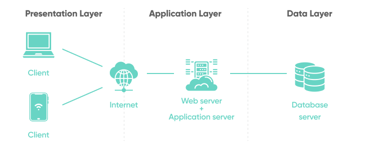

# Agent API Overview

This document provides an overview of the responsibilities of an agent API, how they acquire clients, and the truth about working as an insurance agent.

## Responsibilities of an Agent

Insurance agents play a vital role in helping businesses and individuals choose the right insurance products. Their responsibilities include a range of activities that involve direct interaction with clients and administrative duties. Key responsibilities include:

### 1. **Architecture Diagram**
   

   - **Meeting with business owners and decision-makers**: Insurance agents introduce themselves and explain the benefits of the insurance products they represent.
   - **Tailored coverage packages**: Agents develop custom coverage solutions that meet the unique needs of each client.
   - **Client consultations**: Regular meetings with clients to ensure their coverage packages are updated and aligned with evolving business needs.

### 2. **Employee Benefits Education**
   - **Employee enrollment**: Insurance agents meet with employees to educate them on available benefits and assist them with enrollment in insurance plans.

### 3. **Marketing & Advertising**
   - **Promoting new policies**: Agents market and advertise new policies or changes to existing coverage to raise awareness.
   - **Digital marketing**: Agents leverage social and digital marketing strategies to reach new clients.

### 4. **Administrative & Recordkeeping**
   - **Smooth client operations**: Handling administrative duties to ensure clients’ enrollments and claims are processed smoothly.
   - **Self-management**: Maintaining proper recordkeeping for business operations.

### 5. **Leveraging Technology**
   - **Optimizing practice**: Using CRM tools, automation software, and other technologies to streamline workflows and improve efficiency.

## How Do Insurance Agents Get Clients?

Insurance agents use various methods to acquire clients. Some common techniques include:

- **Cold calling**: Reaching out to business owners or leads to offer services.
- **In-person meetings**: Visiting businesses directly to introduce themselves and build relationships.
- **Digital marketing**: Increasingly, agents use online platforms, social media, and digital marketing to promote their services.
- **CRM & automation tools**: Managing their client base through CRM systems and using automation to streamline sales and follow-up processes.

### Client Retention and Renewals
When working with insurance carriers offering renewal commissions (such as Aflac), agents can continue earning income from policies they sold, even after the initial sale. Agents can maintain their client base while also pursuing new sales opportunities.

